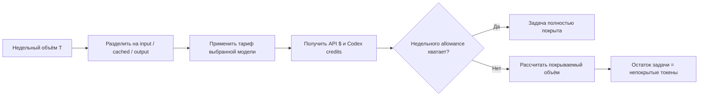
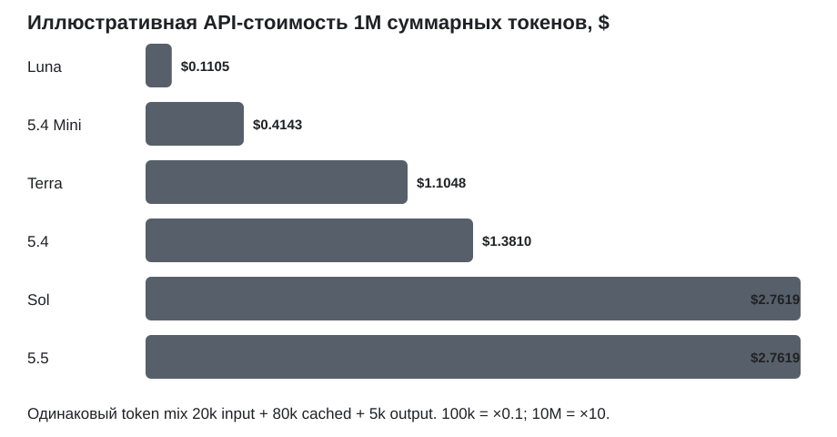

Cost(10M)=10P_{blended}.
\]

Для Codex credits применяется абсолютно та же операция с blended credit rate.

## Сравнение стоимости

### Основная сравнительная таблица

Все долларовые оценки ниже — **эквивалентная API-стоимость того же token mix**, а не утверждение о денежном списании с вашей подписки Codex. Codex при ChatGPT-sign-in использует credits и включенные allowance. Эти две системы следует держать раздельно.

| Ранг | Модель / вариант | Version | Throughput | Иллюстр. $/1k total | 100k / нед. | 1M / нед. | 10M / нед. |
|---:|---|---|---|---:|---:|---:|---:|
| 1 | **Luna Low / Medium / High / XHigh / Max** | 5.6 | Fast 1.5×; abs. н/д | **$0.0001105** | **$0.0110** | **$0.1105** | **$1.1048** |
| 2 | **GPT‑5.4 Mini** | 5.4 Mini | abs. н/д | $0.0004143 | $0.0414 | $0.4143 | $4.1429 |
| 3 | **Terra Low / Medium / High / XHigh / Max** | 5.6 | Fast 1.5×; abs. н/д | $0.0011048 | $0.1105 | $1.1048 | $11.0476 |
| 4 | **GPT‑5.4** | 5.4 | Fast 1.5× | $0.0013810 | $0.1381 | $1.3810 | $13.8095 |
| 5= | **Sol Low / Medium / High / XHigh / Max** | 5.6 | Fast 1.5× | $0.0027619 | $0.2762 | $2.7619 | $27.6190 |
| 5= | **Sol Ultra*** | 5.6 | multi-agent | $0.0027619/token mix* | $0.2762* | $2.7619* | $27.6190* |
| 5= | **GPT‑5.5** | 5.5 | Fast 1.5× | $0.0027619 | $0.2762 | $2.7619 | $27.6190 |

Тарифные данные, из которых получена таблица:

\* Строка Ultra показывает стоимость **при искусственном условии одинакового количества токенов**. На реальной задаче Ultra нельзя считать равным остальным вариантам Sol: он использует несколько агентов и специально предназначен для обмена дополнительного token usage на более сильный результат. Поэтому фактическая стоимость задачи Ultra может быть значительно выше таблицы.

### Тот же объем в Codex credits

| Модель | Credits / 1k total* | 100k токенов | 1M токенов | 10M токенов |
|---|---:|---:|---:|---:|
| **GPT‑5.6 Luna** | **0.002762** | **0.276** | **2.762** | **27.619** |
| **GPT‑5.4 Mini** | 0.010381 | 1.038 | 10.381 | 103.810 |
| **GPT‑5.6 Terra** | 0.027619 | 2.762 | 27.619 | 276.190 |
| **GPT‑5.4** | 0.034524 | 3.452 | 34.524 | 345.238 |
| **GPT‑5.6 Sol** | 0.069048 | 6.905 | 69.048 | 690.476 |
| **GPT‑5.5** | 0.069048 | 6.905 | 69.048 | 690.476 |

\* Снова используется одинаковая иллюстративная пропорция 20:80:5. Исходные Codex rates — официальная token-based rate card.

Для GPT‑5.4 Mini есть небольшая особенность: Codex публикует 113 credits/1M output, тогда как простая пропорция от API-тарифа могла бы дать немного другое значение. Поэтому credits нельзя автоматически объявлять денежным эквивалентом API-долларов. Я использовал именно официальные 113 credits.

### Индекс экономичности

Определим чисто тарифный индекс:

\[
Efficiency_m
=
100\times
\frac{P_{Luna}}{P_m}.
\]

То есть Luna = 100. Чем выше результат, тем больше токенов можно купить на одинаковую условную сумму.

| Модель | Индекс, Luna=100 | Разница стоимости против Luna |
|---|---:|---:|
| GPT‑5.6 Luna | **100.0** | 1× |
| GPT‑5.4 Mini | 26.7 | 3.75× дороже |
| GPT‑5.6 Terra | 10.0 | 10× дороже |
| GPT‑5.4 | 8.0 | 12.5× дороже |
| GPT‑5.6 Sol | 4.0 | 25× дороже |
| GPT‑5.5 | 4.0 | 25× дороже |

Это **не quality-adjusted benchmark**. Он отвечает только на вопрос «сколько стоит одинаковый набор токенов».

### График

На графике ниже показана API-стоимость 100k, 1M и 10M токенов при одинаковом illustrative workload. Вертикальная шкала логарифмическая, поскольку между Luna и Sol разница достигает 25×. Тарифы соответствуют официальным ценам, актуальным на дату исследования.

