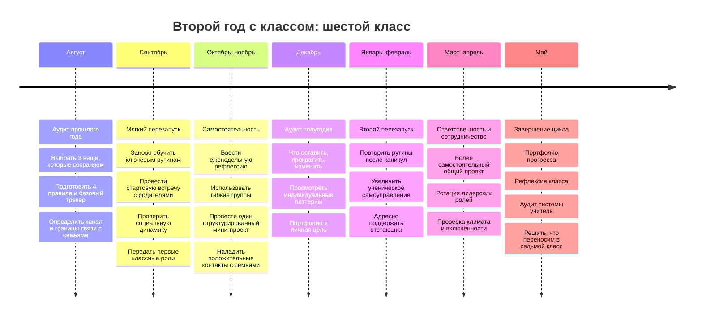

# Практическая система классного руководства в шестом классе: второй год

> Веб-версия практического отчёта. Исходный Deep Research-отчёт был подготовлен в ChatGPT 23–24 августа 2026 года. Интерактивные citation-чипы ChatGPT в статическую копию не переносятся; ниже сохранены содержание, рекомендации и названия основных источников.

## Резюме для принятия решений

Второй год с одним классом лучше строить не как «ещё один пятый класс», а как переход от **знакомства и установления отношений** к **системе, самостоятельности и устойчивым нормам**.

Для шестиклассников это особенно важно. Большинство детей этого возраста входят в ранний подростковый период. Возрастает значение сверстников, социальной оценки и автономии, тогда как саморегуляция ещё развивается.

Практический вывод: **меньше импровизационного «тушения пожаров», больше заранее обученных процедур**.

На учебный год разумно поставить шесть приоритетов:

| Приоритет | Что делать |
|---|---|
| Сохранить отношения | Оставить традиции, юмор, ритуалы и способы общения, которые уже создали доверие |
| Перезапустить правила | В сентябре заново обучить 4–5 ключевым процедурам, а не говорить: «Вы уже большие и всё знаете» |
| Передать часть ответственности | Классные роли, временные команды, ученики-организаторы, рефлексия и самооценка |
| Отслеживать социальную динамику | Не ждать открытой травли. Наблюдать изоляцию, систематические насмешки, исключение из групп |
| Сделать прогресс видимым | Короткие формативные проверки, рубрики, портфолио и простой классный трекер |
| Защитить собственное время | Один канал связи, фиксированные окна сообщений, шаблоны, пакетная обработка задач |

Что стоит изменить по сравнению с пятым классом: **меньше тотального контроля, больше ограниченного выбора; меньше длинных нравоучений, больше коротких процедур; меньше коллективной ответственности за поступок одного ребёнка, больше индивидуальной; меньше мероприятий «потому что положено», больше событий с понятной целью; меньше ручного администрирования, больше шаблонов.**

Главная ловушка второго года — считать, что отношения уже выстроены и правила теперь работают автоматически. После лета состав дружеских групп, статус учеников, физическое взросление и отношение к авторитетам могут измениться. Поэтому начало шестого класса полезнее рассматривать как **мягкий перезапуск**.

## Приоритеты второго года и психология шестиклассника

Шестой класс удобнее понимать не как «дети стали хуже себя вести», а как изменение баланса между **потребностью в самостоятельности**, **сильным влиянием сверстников** и всё ещё формирующейся способностью заранее оценивать последствия.

| Особенность | Что может увидеть учитель | Практический ответ | Риск неправильной реакции |
|---|---|---|---|
| Значимость сверстников | демонстративность, шутки «на публику», болезненная реакция на статус | корректировать поведение приватно, не превращать замечание в представление | публичная перепалка даёт ученику аудиторию |
| Потребность в автономии | споры «почему я должен», сопротивление мелкому контролю | давать выбор внутри заданных границ | либо тотальный контроль, либо отсутствие границ |
| Развивающаяся саморегуляция | забытые принадлежности, дедлайны, импульсивные ответы | чек-листы, визуальные инструкции, одинаковые процедуры | трактовать организационную ошибку как злой умысел |
| Повышенная социальная чувствительность | переживание из-за насмешек, компаний, исключения | следить за микрогруппами и принадлежностью | считать «детскими разборками» устойчивую травлю |
| Быстрые изменения развития | резкие различия в зрелости внутри одного класса | не сравнивать детей по единому образцу «взрослости» | ярлыки «инфантильный», «слишком взрослый» |
| Возрастающая способность рассуждать | интерес к справедливости, правилам, дискуссиям | обсуждать причины правил, давать реальные задачи | длинные абстрактные морализаторские лекции |

### Простая рутина начала урока или классного часа

> Вошёл → подготовил нужное → увидел первое задание → начал самостоятельно.

Первое задание занимает 2–5 минут и не требует нового объяснения: один вопрос из прошлой темы, короткое наблюдение, выбор ответа, запись цели или мини-опрос.

**Время внедрения:** 10–15 минут на обучение процедуре в начале года и несколько минут на повторное обучение при сбое.  
**Стоимость:** 0.  
**Риск:** превратить рутину в ежедневную проверку послушания. Она должна снижать когнитивную нагрузку, а не создавать новый повод для замечаний.

### Модель «оставить — прекратить — начать»

| Оставить | Прекратить | Начать |
|---|---|---|
| 2–3 традиции прошлого года, которые детям действительно нравились | мероприятия ради количества | квартальный аудит того, что реально работает |
| узнаваемый стиль общения | повторять одинаковые замечания без изменения системы | учить процедуре после повторяющегося сбоя |
| личные короткие разговоры | решать индивидуальные проблемы публично | разговаривать один на один |
| положительные контакты с семьями | писать родителям только при проблемах | планировать положительные сообщения |
| совместные дела | делать всё за детей | передавать реальные роли ученикам |

## Управление классом: правила, рутины, рассадка и восстановительные практики

Самая экономичная система дисциплины состоит не из большого количества санкций, а из нескольких предсказуемых элементов:

**малое число правил → обучение конкретному поведению → одинаковые реакции взрослого → спокойное исправление → индивидуальная поддержка при повторении проблемы.**

### Шаблон правил класса

Лучше 4 понятных правила, чем 15 запретов.

| Правило | Как оно выглядит на практике |
|---|---|
| **Уважаем человека** | не унижаем, не высмеиваем, не трогаем чужие вещи без разрешения |
| **Даём другим учиться** | слушаем во время инструкции, соблюдаем установленный уровень голоса |
| **Берём ответственность** | при ошибке не ищем виноватого, а исправляем то, что можем |
| **Соблюдаем безопасность** | выполняем правила кабинета, мероприятий и цифрового общения |

Правила стоит обсудить с классом, но не отдавать базовые вопросы безопасности и человеческого достоинства на голосование.

На первой неделе показать 2–3 ситуации на каждое правило. Спросить: «Как выглядит соблюдение? Как выглядит нарушение?» Затем потренировать наиболее частые процедуры. Через неделю провести пятиминутный повтор. После каникул — повторить снова.

### Матрица поведения вместо постоянных замечаний

| Ситуация | Голос | Помощь | Действие | Перемещение | Что считается участием |
|---|---|---|---|---|---|
| Самостоятельная работа | тихо | сначала инструкция, затем учитель | выполняем своё задание | остаёмся на месте | есть письменная работа |
| Работа в группе | тихий разговор | сначала группа, затем учитель | выполняем роль | внутри своей зоны | каждый что-то вносит |
| Обсуждение | один говорит | вопрос учителю/классу | слушаем и отвечаем | нет | ответ, вопрос или запись |
| Переход | без обсуждений или тихо | не требуется | убрать → взять → начать | только необходимое | готовность к следующему этапу |

Это переводит требование «ведите себя нормально» в наблюдаемое поведение.

### Лестница реакции на нарушение

**Сигнал → короткое напоминание → выбор → логичное последствие по правилам школы → разговор после ситуации → индивидуальный план при повторяющемся паттерне.**

Пример:

> «Сейчас самостоятельная работа. Нужен тихий голос. Продолжай, пожалуйста».

Если продолжается:

> «Ты можешь продолжить здесь по правилу или пересесть на это место и закончить работу там».

После урока:

> «Я не хочу обсуждать тебя как человека. Давай разберём конкретную ситуацию. Что произошло? Что помешало? Что сделаем в следующий раз?»

### Позитивное подкрепление без детского «магазина призов»

Шестикласснику подходит конкретная обратная связь:

> «Вы начали работу через 20 секунд после инструкции. Поэтому мы не потеряли время».

> «Ты сам исправил ситуацию после замечания. Вот это ответственность».

Это полезнее бесконечного «молодец», потому что называет конкретное поведение.

### Рассадка как инструмент, а не наказание

Рассадку стоит менять **по цели деятельности**, а не по принципу «хорошие впереди, плохие назад».

Для объяснения и индивидуальной работы удобны пары/ряды. Для структурированного сотрудничества — небольшие группы. Для обсуждения отношений или классного вопроса — круг или полукруг.

Практический вариант: иметь **базовую рассадку** и 2 заранее знакомых режима перестройки. Не менять её ежедневно.

### Восстановительный разговор

Восстановительный подход не означает отсутствие последствий. Его задача — после нарушения восстановить безопасность, ответственность и рабочие отношения.

Мини-шаблон:

> Что конкретно произошло?  
> Кто был затронут?  
> Что ты думаешь об этом сейчас?  
> Что необходимо исправить?  
> Что сделаешь, если ситуация повторится?

Для бытового конфликта достаточно 5–10 минут.

Устойчивую травлю нельзя сводить к «пусть оба поговорят и помирятся». При признаках систематической травли алгоритм другой:

**зафиксировать факты → обеспечить немедленную безопасность → сообщить ответственным сотрудникам по локальному алгоритму → подключить психолога/администрацию → отдельно работать с участниками и группой → наблюдать динамику.**

Не устраивать публичный «суд класса».

## Мотивация, обучение и отслеживание прогресса

Для шестого класса лучше работает не один «секрет мотивации», а сочетание **ясной цели, посильной сложности, ограниченного выбора, быстрой информации о прогрессе, отношений и реальной самостоятельности**.

### Сравнение основных подходов

| Подход | Уровень уверенности | Как использовать | Время/стоимость | Основной риск |
|---|---|---|---|---|
| Формативная проверка | высокий | 1–3 вопроса во время или в конце работы | 2–5 мин; 0 | собирать данные и ничего не менять |
| Конкретная обратная связь | высокий | цель → текущее состояние → следующий шаг | 30 сек–2 мин; 0 | писать длинные комментарии |
| Метакогнитивные вопросы | высокий | планирую → проверяю → корректирую → оцениваю | 3–5 мин; 0 | превратить рефлексию в формальность |
| Гибкие группы | умеренно высокий | временно объединять по текущей потребности | 2–5 мин; 0 | постоянные ярлыки «сильные/слабые» |
| Извлечение из памяти | высокий для закрепления знаний | короткий low-stakes quiz без наказания | 3–7 мин; 0 | тестировать только мелкие факты |
| Проекты | контекстный | как структурированное применение уже изученного | часы/дни | заменить проектом систематическое обучение |
| Геймификация | смешанный/контекстный | короткими циклами ради конкретного поведения | 5–15 мин подготовки | зависимость от награды и рейтинг |
| Growth mindset | небольшой и контекстный эффект | стратегия + обратная связь + новая попытка | 1–3 мин | лозунг «просто старайся» |

### Как делать мини-проект

1. Одна проблема.
2. Один конечный продукт.
3. Понятная рубрика.
4. Ограниченные роли.
5. Промежуточная проверка.
6. 1–2 недели, а не два месяца.

Например: «Как сделать школьную перемену комфортнее?» Группы собирают наблюдения, формулируют проблему, предлагают решение, оценивают стоимость/ограничения и защищают идею.

### Формативные лайфхаки

**Exit ticket.** В конце:

> Что сегодня стало понятнее?  
> Где ещё есть вопрос?  
> Какой один шаг нужен дальше?

**Мини-доски.** Все дети показывают ответ одновременно. Учитель видит распределение понимания, а не только ответ ученика с поднятой рукой.

**Извлечение из памяти.** 3–5 вопросов из предыдущих недель без отметки либо с минимальным весом.

### Формула короткой обратной связи

> **Цель:** что должно получиться.  
> **Сейчас:** что уже получилось.  
> **Следующий шаг:** одно конкретное улучшение.

Пример:

> «Аргумент понятен. Сейчас не хватает доказательства из текста. Добавь одну цитату или конкретный эпизод и объясни, как он подтверждает вывод».

### Growth mindset без лозунгов

Полезнее спрашивать:

> «Какая стратегия уже сработала?»  
> «В каком месте ты застрял?»  
> «Что можно изменить во второй попытке?»  
> «Какую помощь тебе нужно запросить?»  
> «Как поймёшь, что стало лучше?»

То есть акцент на **изменяемой стратегии**, а не на абстрактном старании.

### Простая рубрика для проекта

| Критерий | Уверенно | В основном | Пока требуется помощь |
|---|---|---|---|
| Содержание | вывод точный и подтверждён | в основном точный, есть пробелы | вывод не подтверждён |
| Аргументация | объяснено «почему» | объяснение частичное | в основном утверждения |
| Продукт | отвечает задаче и понятен аудитории | основная задача выполнена | часть задачи отсутствует |
| Работа команды | вклад участников виден | роли распределены неравномерно | работу фактически выполнили 1–2 человека |

Рубрика должна быть известна **до**, а не после выполнения работы.

### Портфолио без лишней бюрократии

Раз в месяц каждый ученик сохраняет:

**одну работу, которой доволен → одну работу после исправления → короткую рефлексию.**

Шаблон:

> Чем я доволен?  
> Что стало лучше после исправления?  
> Что хочу научиться делать в следующем месяце?

### Трекер классного руководителя

Не нужно вести психологический рейтинг детей. Достаточно наблюдаемых школьных показателей.

| Ученик | Посещаемость/опоздания | Сроки и задания | Повторяющаяся учебная трудность | Поведенческий факт | Положительное событие | Следующий шаг | Проверить |
|---|---|---|---|---|---|---|---|
| А. | без изменений | 2 пропуска срока | длинные инструкции | — | помог группе | чек-лист | 20.09 |
| Б. | 3 опоздания | норма | — | 2 конфликта на перемене | сильный ответ | разговор + наблюдение | 16.09 |

Записывать лучше **факт**, а не интерпретацию:

- «три раза не сдал в срок» вместо «ленивый»;
- «дважды перебил одноклассника после напоминания» вместо «не уважает людей».

Мониторинг имеет смысл только при связке **данные → действие → дата повторной проверки**.

## Родители, коллеги и сложные разговоры

Связь с родителем не должна начинаться фразой «Нам надо поговорить» после третьего серьёзного нарушения.

### Практичная частота контактов

| Контакт | Разумный ритм | Содержание |
|---|---|---|
| Общий информационный дайджест | 1 раз в неделю | ближайшие даты, 3–5 важных пунктов |
| Положительный личный контакт | 2–3 семьи в неделю по ротации | конкретный успех |
| Индивидуальная проблема | после устойчивого паттерна или значимого события | факты + совместный план |
| Классная встреча | по плану школы; обычно несколько раз за год | только то, что требует общего обсуждения |
| Короткая сверка с предметниками | 1 раз в 1–2 недели при необходимости | тенденции, не сбор жалоб |

Это не нормативная частота, а рабочая схема. Конкретный порядок определяется школой.

### Шаблон еженедельного сообщения родителям

> **Добрый вечер. Главное по 6___ классу на следующую неделю.**
>
> На этой неделе: ________.
>
> На следующей важно:  
> — ________;  
> — ________;  
> — ________.
>
> Пожалуйста, обратите внимание на ________.
>
> Из хорошего: на этой неделе класс ________.
>
> По индивидуальным вопросам лучше написать мне лично. Обсуждать ситуации конкретных детей в общем чате не будем.
>
> Спасибо.

### Положительное сообщение

> «Добрый день. Сегодня хочу написать не из-за проблемы. На ________ ваш ребёнок ________. Особенно отметил(а), что он/она ________. Считаю важным, чтобы вы об этом знали».

### Шаблон сложного разговора

| Этап | Пример |
|---|---|
| Цель | «Хочу вместе понять, как снизить количество конфликтов» |
| Сильная сторона | «При этом он хорошо включается в практические задания» |
| Наблюдаемые факты | «За последние 8 учебных дней было три ситуации…» |
| Вопрос семье | «Что вы наблюдаете дома? Есть ли обстоятельства, которые нам стоит знать?» |
| Один план | «Договоримся о таком алгоритме…» |
| Ответственность | «Я делаю X, ученик Y, дома — Z» |
| Срок | «Через две недели сравним ситуацию» |

Формула деэскалации:

> **Факт → влияние → вопрос → совместный шаг → срок проверки.**

### Мини-протокол документации

После важного разговора записать:

> **Дата:**  
> **Участники:**  
> **Наблюдаемые факты:**  
> **Что сообщила семья/ученик:**  
> **О чём договорились:**  
> **Кто что делает:**  
> **Когда проверяем:**

Хранить сведения следует только в разрешённой школой среде и в объёме, необходимом для работы.

### Коллеги: пятиминутная система раннего сигнала

Вместо запроса «Как вообще мой класс?» лучше раз в 1–2 недели спрашивать три вещи:

> «У кого появился новый устойчивый провал?»  
> «У кого заметно улучшение?»  
> «Есть ли повторяющаяся проблема, которую вы уже пробовали решать?»

Так легче увидеть **паттерн между предметами**, а не собирать случайные жалобы.

## Время, нагрузка и рабочие границы

Если система требует ежедневной ручной обработки десятков сообщений, заполнения нескольких параллельных таблиц и длинных письменных комментариев, она с высокой вероятностью перестанет выполняться последовательно.

### Еженедельный «час классного руководителя без детей»

Даже 45 минут дают систему:

| Минуты | Задача |
|---:|---|
| 10 | просмотреть трекер и посещаемость |
| 10 | определить максимум 3 приоритета недели |
| 10 | положительные контакты с семьями |
| 10 | вопросы предметникам/психологу/администрации |
| 5 | буфер |

Главное правило: **не превращать этот блок в подготовку мероприятий**. Он предназначен для управления системой.

### Сообщения пакетами

Не проверять родительский канал после каждого уведомления.

Практический режим:

- одно окно перед/после основной работы;
- второе короткое окно ближе к завершению рабочего дня;
- экстренные ситуации идут по школьному экстренному алгоритму, а не через ожидание постоянной доступности классного руководителя.

### Проверка работ: меньше письменного труда, больше следующего действия

Экономичный цикл:

**быстро просмотреть выборку → найти 2–3 общие ошибки → на следующем уроке дать общую обратную связь → ученики исправляют собственную работу → точечно помочь тем, кому этого недостаточно.**

### Делегирование шестиклассникам

| Роль | Реальная задача |
|---|---|
| Координатор материалов | выдача и сбор общих материалов |
| Команда событий | 2–3 варианта классного события с бюджетом и планом |
| Информационная группа | общий календарь класса |
| Команда пространства | следит за тем, что действительно нужно обновить в кабинете |
| Модератор обсуждения | соблюдение очередности реплик по заданной процедуре |

Не делегировать детям конфиденциальные сведения, санкции, оценивание личности одноклассников или роль «помощника учителя по дисциплине».

### Правило «одно вошло — одно вышло»

Каждую новую традицию, таблицу или активность проверять вопросом:

> **Что я перестану делать вместо этого?**

Полезный stop-list:

- не делать отдельный документ, если данные уже есть в официальной системе;
- не оформлять мероприятие дольше, чем длится его педагогическая ценность;
- не давать длинный ответ там, где работает шаблон;
- не обсуждать конфликт вечером на эмоциях;
- не выполнять за учеников организационную работу, которую они уже способны сделать.

## Рабочая система на год и готовые шаблоны

### Минимальный недельный ритм

| День | 5–15 минут работы |
|---|---|
| Понедельник | обозначить 2–3 события недели; короткая общая настройка |
| Вторник | поговорить индивидуально с 2–3 учениками, которых давно не спрашивали |
| Среда | посмотреть трекер: посещаемость, сроки, повторяющиеся сигналы |
| Четверг | 2–3 положительных сообщения семьям; при необходимости сверка с предметниками |
| Пятница | 5–10 минут классной рефлексии: что сработало, что надо изменить |

### Пятничная рефлексия класса

Три вопроса:

> Что на этой неделе у нас получилось как у класса?
>
> Где мы сами себе мешали?
>
> Какое одно изменение проверим на следующей неделе?

Не проводить голосование «кто хуже всех себя вёл». Обсуждать процессы, а не личности.

### Индивидуальный мини-чек-ин

Для ребёнка, у которого появились трудности:

> Как сейчас школа по шкале от 1 до 5?  
> Что идёт нормально?  
> Что сильнее всего мешает?  
> Что ты можешь сделать сам?  
> Что могу сделать я?  
> Когда проверим?

Это не психологическая диагностика. При признаках серьёзного психологического неблагополучия или угрозы безопасности нужно использовать профессиональный и локально установленный маршрут помощи.

### Одностраничный план воспитательной работы

| Период | Главная задача класса | 1 общее действие | 1 навык | Что наблюдаем | Как поймём результат |
|---|---|---|---|---|---|
| Сентябрь | восстановить рабочую систему | перезапуск правил | самоорганизация | переходы, сроки | меньше повторных напоминаний |
| Октябрь | укрепить связи | смешанные командные задачи | сотрудничество | кто остаётся вне групп | каждый работал с разными детьми |
| Ноябрь | ответственность | мини-проект | планирование | выполнение ролей | продукт + рефлексия |
| Декабрь | анализ полугодия | портфолио | самооценка | индивидуальный прогресс | личная цель на январь |

## Дорожная карта учебного года

## Ресурсы и инструменты

При выборе ресурсов полезно разделять **нормативный источник**, **исследовательский синтез** и **практическую книгу**.

| Приоритет | Источник | Для чего использовать |
|---|---|---|
| Обязательный уровень | ФГОС ООО, приказ № 287 | нормативная рамка основного общего образования |
| Обязательный уровень | ФОП ООО, приказ № 370 и изменения | актуальная федеральная образовательная программа |
| Очень высокий | Единое содержание общего образования | воспитательная работа, классное руководство, планирование, методические материалы |
| Очень высокий | Портал психологической службы образования | буллинг, профилактика рисков, школьная психологическая практика |
| Высокий | EEF — Improving Behaviour in Schools | рутины, поведение, индивидуальная поддержка, последовательность |
| Высокий | EEF — Metacognition and Self-Regulation | самостоятельность, планирование и рефлексия ученика |
| Высокий | AERO — Formative Assessment | формативные проверки, обратная связь, мониторинг |
| Высокий | IES / What Works Clearinghouse | проверка эффективности конкретных образовательных вмешательств |
| Высокий | EEF — Working with Parents | коммуникация и вовлечение семей |
| Практический | Сферум в MAX | школьная коммуникация, если канал принят школой |

Из цифровых инструментов не нужно строить отдельную «экосистему классного руководителя». Достаточны четыре функции: **официальный канал связи, календарь, простой трекер и хранилище шаблонов**.

Из книг как вторичного, а не нормативного источника полезны:

- Dylan Wiliam, *Embedded Formative Assessment* — формативное оценивание и обратная связь;
- Tom Bennett, *Running the Room: The Teacher's Guide to Behaviour* — поведенческая культура и рутины.

### Что реально подготовить к 1 сентября

Не двадцать документов. Всего семь рабочих вещей:

1. одна страница правил;
2. одна схема реакции на нарушение;
3. базовая рассадка;
4. недельный шаблон сообщения родителям;
5. таблица наблюдения за классом;
6. список ученических ролей;
7. календарь четырёх контрольных точек года.

Подготовка такой системы потребует ориентировочно **2–4 часа один раз**, после чего — порядка **45–75 минут административной работы в неделю**, не считая предусмотренных школой обязательных мероприятий. Это практическая оценка, а не норматив времени.

## Отдельно о плакате на шестой класс

Для плаката в стиле кино-/наградной афиши лучше не помещать правила, цели и педагогические формулировки. Его задача — **обозначить переход во второй совместный год и новый статус класса**.

Самый сильный вариант:

> **ШЕСТОЙ**  
> **ВТОРОЙ ГОД ВМЕСТЕ**  
> *Планка выше.*

Более серьёзный:

> **6 КЛАСС**  
> **НОВАЯ ГЛАВА**  
> *Не просто становимся старше. Учимся быть самостоятельнее.*

Более кинематографичный:

> **НОВЫЙ СЕЗОН**  
> **ТЕ ЖЕ ГЕРОИ**  
> *Больше самостоятельности. Больше ответственности. Больше историй.*

Более философский:

> **ШЕСТОЙ КЛАСС**  
> *Год пройдёт.*  
> **Важно, кем мы из него выйдем.**

Более сухой и сильный:

> **ВТОРОЙ ГОД ВМЕСТЕ**  
> **ПЯТЫЙ БЫЛ НАЧАЛОМ.**

По композиции достаточно четырёх уровней текста: сверху мелко — **«2026–2027 учебный год»**; крупный центральный заголовок — **«6 КЛАСС»** или **«ШЕСТОЙ»**; ниже одна сильная фраза; внизу мелко — **«Второй год вместе»**.

Главная педагогическая идея года при этом может оставаться за кадром плаката: **в пятом классе вы строили класс; в шестом стоит учить этот класс постепенно управлять собой**.
