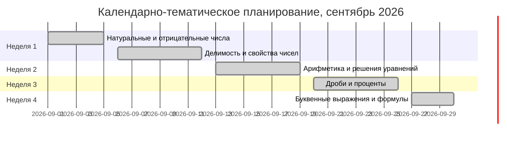

# Исполнительное резюме  
Программа по математике для 6 класса (ФГОС ООО) включает разделы: натуральные числа, дроби (обыкновенные, десятичные и проценты), положительные и отрицательные числа, буквенные выражения (степени, формулы), решение текстовых задач (в том числе на движение, части, пропорции и проценты), представление данных (таблицы, линейные/столбчатые/круговые диаграммы) и наглядную геометрию (прямые на плоскости, осевая/центральная симметрия, плоские и пространственные фигуры). Обучающиеся должны уметь выполнять арифметические действия с различными видами чисел, решать уравнения, составлять и преобразовывать буквенные выражения, решать прикладные задачи, работать с данными и строить простейшие геометрические конструкции. По программе отведено 170 часов (5 ч/нед) на 6 класс. Приблизительное распределение по темам: натуральные числа (~30 ч, 6 нед); дроби и проценты (~38 ч, 7–8 нед); положительные/отрицательные числа (~40 ч, 8 нед); буквенные выражения (~6 ч, 1–2 нед); представление данных (~6 ч, 1 нед); наглядная геометрия (прямые – 7 ч, симметрия – 6 ч, плоские фигуры – 14 ч, пространственные – 9 ч; всего ~36 ч, 7–8 нед).  

## Типы задач ВПР по математике 6 класса  
ВПР-6 включает задачи двух частей (17 заданий: 11 закрытых и 6 с развернутым ответом). Типовые задания по содержанию охватывают:
- **Арифметические вычисления**: действия с натуральными, целыми, дробями, десятичными числами. Примеры: вычислить −2·(54+129)= −366 или (6/5−3/4)·(2/3) (решение через приведение к общему знаменателю), вычислить 1,54+0,5·(−1,3)=0, (ответ 0,89).  
- **Уравнения и выражения**: линейные уравнения, преобразования буквенных выражений. Пример: «Решите уравнение 6x + 0,9 = 8,4 + x» (решение: перенести x, найти x=1,35).  
- **Процентные и пропорциональные задачи**: вычисление процентов, решения на составление пропорций. Пример: «Ежемесячная плата 680 ₽, выросла на 5%. Новая плата?» (решение: 680·1,05=714 ₽).  
- **Задачи на движение, работу и пропорции** (с развернутым ответом): задачи «текучие» (работа насоса, скорость течения) и сложности «двумя шагами». Пример: «Теплоход 60 км по течению за 4 ч, скорость течения 1,5 км/ч. Сколько времени против течения?» (решение через скорости).  
- **Геометрические задания**: простые построения и чтение чертежей, координаты, ось симметрии, измерения углов и фигур. Примеры: «На рисунке с треугольником и несколькими прямыми, какая — ось симметрии?»; «Установите соответствие: точкам A, B, C на числовой прямой сопоставить координаты из списка».  
- **Логические задачи и комбинированные задачи с развернутым ответом**: задачи со словами и логическими рассуждениями. Пример: «В семье три мальчика и две девочки. Какие утверждения истинны? (Например, «У каждого мальчика столько же братьев, сколько и сестёр» – неверно)».  
- **Представление данных**: чтение и построение диаграмм (столбчатых/круговых) и расчет среднего. Пример: «На диаграмме показаны оценки: сколько всего учеников?»; «Найдите среднее арифметическое чисел 81, 34, 17, 23, 75» (решение: сумма 230/5=46).  

Каждому типу соответствует свой раздел программы: арифметика – раздел «Натуральные числа», дроби/проценты – «Дроби», уравнения – «Буквенные выражения», текстовые задачи (включая логику) – «Решение текстовых задач», представление данных – «Представление данных», геометрия – «Наглядная геометрия». Сложность заданий варьируется от простых (вычисления, чтение диаграмм) до средних (задачи на проценты, уравнения) и более сложных (задачи 2 части, задачи на логику и многослойные текстовые задачи).  

## Соответствие типов задач разделам программы  

| Тип задачи                | Пример (схематичное условие)                              | Раздел программы              | Предполагаемые сроки (недели) | Сложность       |
|--------------------------|----------------------------------------------------------|-------------------------------|------------------------------|-----------------|
| Арифметические вычисления (степени, дроби, отриц. числа) | 1) «Вычислите −2·(54+129)»; 2) «(6/5−3/4)·(2/3)» (решение через общие знаменатели); 3) «Найдите число, 2/3 которого = 210» (деление 210 на 2/3 = 315). | Натуральные и целые числа; дроби | 1–6 нед. (начало года)      | низкая–средняя |
| Уравнения и буквенные выражения | 1) «Решите уравнение 6x+0,9=8,4+x» (x=1,35); 2) «Найдите неизвестный компонент в равенстве»; 3) «Запишите формулу: площадь прямоугольника» (S=a·b). | Буквенные выражения            | ~21–22 нед. (после арифметики) | средняя        |
| Задачи на проценты и пропорции | «Плата 680 ₽, выросла на 5 %? (714 ₽)»; «Найдите % от числа», «Соотношение как пропорция».        | Дроби (десятичные дроби, проценты) | 7–12 нед.                     | средняя        |
| Логические задачи и «с развернутым ответом» | «Условные утверждения в семье (истина/ложь)»; «Два решения»; «Задача на пальцы/голову (цифры)». | Решение текстовых задач (логика) | В течение года (интегрировано) | средняя–высокая|
| Задачи на движение и работу | «Теплоход 60 км по течению за 4 ч, скорость 1,5 км/ч. Найдите время против течения»; «Насосы на 48 ч и 16 ч вместе» (задача альтернатива). | Решение текстовых задач        | 10–16 нед.                    | средняя–высокая |
| Задачи на чертежи/координаты | «Соотнесите точки A, B, C на числовой прямой с их координатами»; «Диаграмма: сколько всего учеников?». | Представление данных; координаты (Буквы) | 12–20 нед.                   | низкая–средняя |
| Геометрия (углы, симметрия) | «На рисунке треугольник. Какая прямая – ось симметрии?»; «Найдите площадь круга по длине окружности 18,84 м». | Наглядная геометрия (симметрия, углы, площади) | 23–29 нед.                   | средняя        |

## План уроков на сентябрь (20 уроков)  

- **Неделя 1:** Повторение арифметических действий с натуральными числами и введение операций с отрицательными числами. Цели: сверка знаний 5-го класса, закрепление навыков сложения/вычитания многозначных чисел, понятие обратных (отрицательных) чисел. Задачи: устные счёт, устное деление в столбик, тренировка округления. В каждом уроке – задание ВПР-формата (например, вычисление −2·(54+129) или решение простого уравнения 6x+0,9=8,4+x). Домашнее задание: упражнения по теме, задачи на порядок действий. Проверка: устная работа на вх. контроль, тестовые карточки.  
- **Неделя 2:** Делимость и НОД/НОК. Цели: понятие делителя/кратного, формулы наибольшего общего делителя. Задачи: вычисление НОД/НОК, деление с остатком, текстовые задачи на делимость. ВПР-задание: например, заполнение таблицы делимости; проверка гипотез (чётность суммы чётных/нечётных чисел). Домашнее: задачи на делимость и НОД/НОК. Оценивание: индивидуальная работа «мини-тест».  
- **Неделя 3:** Дроби. Цели: обыкновенные дроби, сокращение, сравнение, введение десятичных дробей и процентов. Задачи: арифметические действия с дробями, перевод дроби→% и обратно, примеры задач: «дробь от числа», простые «процент от величины». ВПР-задание: вычисление с дробями или задача «выросла на 5 %». Домашнее: практика вычислений; подготовка к ВПР на доли и проценты. Контроль: решение пары вариативных задач класса (с последующим разбором).  
- **Неделя 4:** Буквенные выражения и формулы. Цели: понятие переменной, составление формул (например, S=ab, V=abc), вычисление по формулам. Задачи: вычислять буквенные выражения при данных переменных, практиковаться в формулах периметра/площади прямоугольника/круга. ВПР-задание: «Запишите формулу площади прямоугольника» или простое вычисление выражения с подстановкой. Домашнее: задачи на составление формул из условия. Оценка: проверка упражнений по формулам, устный блиц с ответами.  

В учебной программе для 6 класса указано по 5 часов в неделю, поэтому в каждой неделе по 5 уроков. План ориентирован на начало года без учёта региональных корректировок. Продолжительность уроков — по 45 минут (стандарт). Источники: Федеральная рабочая программа математики 5–6 классов, официальный демовер ВПР-2025 по математике 6 класса.  

**Источники:** Официальная Федеральная программа обучения математике в 5–6 классах (разделы, результаты, часовое планирование); материалы ФИОКО (демоверсия ВПР-2025), примеры заданий ВПР (интерпретация диаграммы, уравнения, проценты, геометрия, логика).