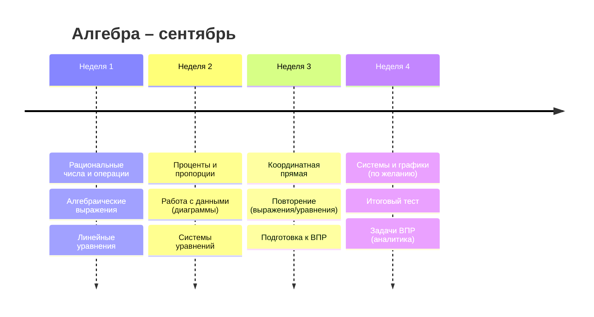
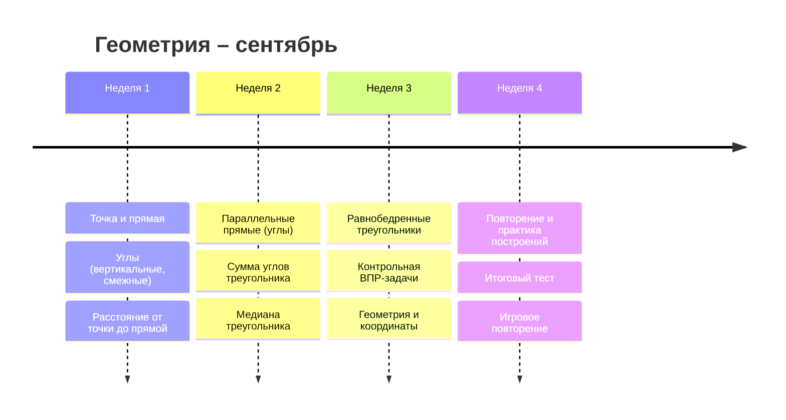
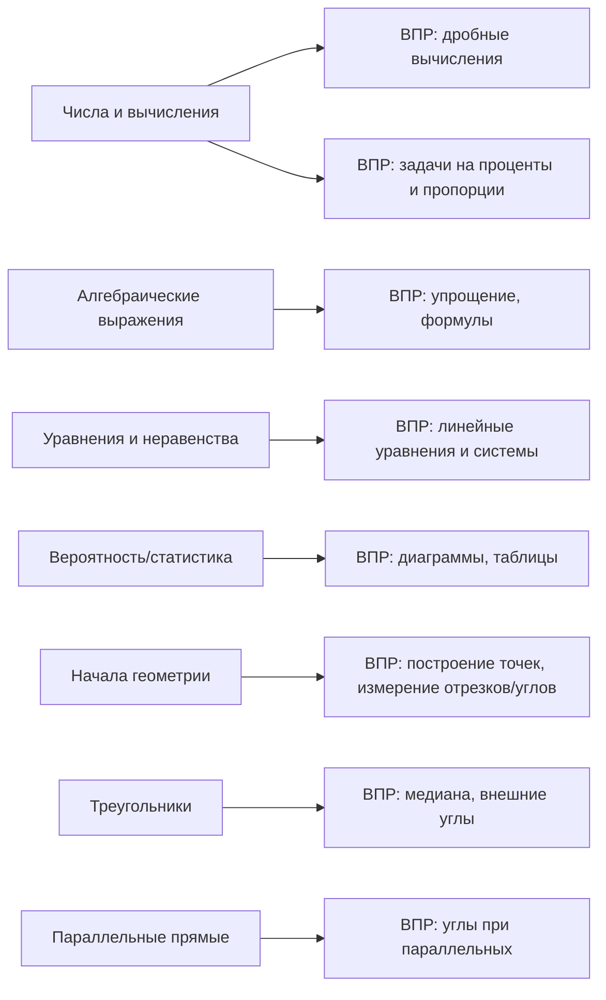

# Краткое содержание

За основу взяты официальные федеральные программы и образовательные стандарты по математике для 7-го класса. В них перечислены темы курса «Алгебра» (рациональные числа, вычисления, выражения, уравнения, функции и др.) и курса «Геометрия» (точка, прямая, углы, треугольники, параллельные прямые, окружность и др.). Типовые задания ВПР по математике для 7-го класса включают задачи на арифметические действия с дробями и процентами, анализ данных по таблицам и круговым диаграммам, решение линейных уравнений и систем уравнений, логические задачи и геометрические построения (построение точек, углов, медиана треугольника, внешние углы и др.). Составлена схема соответствия тем программы и типов заданий ВПР, распределённых по кластерам в сентябре (таблицы по алгебре и геометрии), а также план уроков на четыре недели сентября (12 уроков) с целями, деятельностью, заданиями ВПР-для домашнего задания и точками контроля. Иллюстративно представлен диаграммой-маршрутом последовательности уроков в сентябре.

# 1. Программы «Алгебра 7 класс» и «Геометрия 7 класс»

Официальная программа по математике для 7-х классов (ФГОС нового поколения) подразделяет курс на «Алгебру» и «Геометрию». В программе «Алгебра 7–9» приведены разделы «Числа и вычисления» (рациональные числа, действия с дробями и десятичными дробями, проценты, пропорции, задачи на движение и покупки), «Алгебраические выражения» (мон- и многочлены, тождества, формулы сокращённого умножения, разложение на множители), «Уравнения и неравенства» (линейные уравнения с одной переменной, системы уравнений) и др. Курсы «Геометрия» содержат темы: «Начала геометрии» (точка, прямая, луч, отрезок; углы и их измерение; расстояние от точки до прямой; построения), «Треугольники» (виды треугольников, медианы, биссектрисы, критерии равенства, соотношения сторон и углов, сумма углов треугольника), «Параллельные прямые» (признаки и свойства параллельных прямых, суммы внутренних и внешних углов), «Окружность» (элементы окружности: центр, радиус, хорда) и др. Например, в базовом ФГОС по математике для 7-го класса указано, что учащиеся должны уметь проводить арифметические действия с рациональными числами, находить значения дробных выражений и решать задачи на проценты. Геометрическая часть требует умения строить и измерять отрезки и углы, вычислять внешние углы треугольников и проверять параллельность прямых угловыми признаками.

# 2. Типы заданий ВПР по алгебре и геометрии 7 класса

ВПР по математике 7 класса включает задачи разных типов. Примеры из открытого банка заданий ФИПИ (приведены ниже) иллюстрируют основные типы:

- **Рациональные числа и вычисления**: арифметика с дробями и десятичными дробями. Например: «Найдите значение выражения \( \frac{11}{10}\cdot\frac{3}{2} - \frac{8}{15} \)», «Автомобиль едет со скоростью 22 м/с. Выразите скорость в км/ч». В задании №1 ВПР описано умение выполнять арифметические действия с рациональными числами.
  
- **Работа с данными (диаграммы, графики)**: чтение и интерпретация таблиц и диаграмм. Например, круговая диаграмма с долями продаж товаров; учащимся задаётся вопрос «Каких товаров продано меньше всего? Сколько примерно покупок относится к категории „Электроника“?». В описании заданий ВПР указано чтение информации из круговых и столбчатых диаграмм.
  
- **Задачи на проценты, пропорции, отношения**: прикладные задачи. Например: «Подарок стоит 270 ₽. Катя заплатила 30% от этой суммы, остальное — Маша. На следующий день Катя отдала Маше 40 ₽. Сколько ещё рублей Катя должна отдать, чтобы траты сравнялись?» (сложение процентов, уравнение на реальные числа). Или: «Цена бензина в январе 40 ₽/л. К июлю она выросла на 3%, к ноябрю ещё на 10%. Найдите цену в ноябре». 
  В ВПР по математике эти задачи описаны как «отношение величин, пропорциональность, проценты».
  
- **Линейные уравнения и системы**: решение уравнений и систем. Пример: «Найдите корень уравнения \(5(x - 4{,}2) = 11x\)», «Решите систему \( 5y = 4x + 3,\; 4x = 5y - 3 \)», «Система из двух линейных уравнений». Тема линейных уравнений закреплена в программе и явно отмечена в описании заданий ВПР.
  
- **Алгебраические выражения**: упрощение и вычисление. Например: «Найдите значение выражения \(x(x+10) - (x+5)(x-5)\) при \(x = -\frac{13}{5}\)», «Найдите значение выражения \(x(x+10) - (x+5)(x-5)\) при \(x = -\frac{13}{5}\)», «Вычислите \(c(c-5) + c^2 + 5\) при \(c = 0{,}3\)». Задание №10 ВПР формулирует вычисление значений буквенных выражений и упрощение многочленов.
  
- **Геометрические построения и рассуждения**: задачи на построения на клетчатой бумаге и рассуждения о фигурах. Пример построения: на клетчатой бумаге построен треугольник, требуется найти длину медианы. Задачи на углы: «В треугольнике \(ABC\) \(\angle C=90^\circ\), \(AC=BC\). На стороне \(AB\) отмечена точка \(P\) так, что \(\angle ACP=17^\circ\). Найдите \(\angle APC\)». «Найдите внешний угол при вершине равнобедренного треугольника, если внутренний равен \(30^\circ\)». «Параллельные прямые \(AB\) и \(CD\) пересекают секущие \(EF\) и \(UV\) (см. рисунок). Дан углы \(VLD=58^\circ\), \(KON=85^\circ\). Найдите \(\angle OKN\)». Эти темы отражены в программе по геометрии (углы, медианы, внешние углы, параллельные прямые) и обозначены в описании заданий ВПР.
  
- **Логические задачи**: например, задачи на упорядочение и логические утверждения. «Алексей старше Павла, но младше Сергея. Юрий не старше Алексея. Какие из утверждений верны?» (по сути, анализ отношения величин), «Задача про абажур» – требование найти минимальное число кусков проволоки для каркаса (здесь комбинируются граф и счёт; такого типа задача в ВПР отсутствует, но она проверяет логическое мышление). В описании заданий ВПР приводятся задачи на «логические рассуждения с геометрическими теоремами» и «геометрическое место точек».
  
Таким образом, собраны ключевые типы задач ВПР-7: арифметические вычисления, работа с данными (таблицы, диаграммы), прикладные проценты/пропорции, решение уравнений, геометрические построения/расчёты и логические рассуждения.

# 3. Сопоставление заданий ВПР с темами программы и распределение по неделям

Ниже приведена схема соответствия типов заданий темам программы, а также рекомендуемые интервалы (неделя в сентябре) для их изучения. Учебные недели условно пронумерованы: «Неделя 1–2» (начало сентября) и «Неделя 3–4» (конец сентября). Если порядок тем не регламентирован, отмечено «неопределено».

**Алгебра.** Темы программы и связанные типы задач ВПР:
- **Рациональные числа и вычисления (Числа и вычисления)** – арифметика дробей, десятичных дробей, проценты, пропорции; задачи на движение, покупки. Примеры: вычисление с дробями; перевод единиц скорости; задачи на проценты и простые отношения. Рекомендуется изучать в 1–2 нед. (уроки 1–4 сент.), так как это опора для последующего материала.  
- **Анализ данных (Вероятность и статистика)** – чтение и построение диаграмм и графиков. Типы ВПР: задачи с круговыми и столбчатыми диаграммами. Например, анализ диаграммы покупок. Эта тема может идти параллельно с числами (2–3 недели) или включаться при необходимости (в таблице указан 1–2 нед.).  
- **Алгебраические выражения** – многочлены, тождества, преобразования. Типы ВПР: вычисление значений выражений, упрощение и раскрытие скобок. Рекомендуется 2–3 неделя (уроки 5–7 сентября).  
- **Линейные уравнения и неравенства** – решение линейных уравнений с одной переменной. ВПР: простые линейные уравнения, проверки корней. Период: 2–3 неделя.  
- **Системы уравнений (две переменные)** – решение систем из двух линейных уравнений. ВПР: системы и графические решения. Рекомендуется 3–4 неделя.  
- **Логические и текстовые задачи** – задачи на логику, последовательности, поиск чисел (циклы, цифры). ВПР: логические ребусы (смена цифр, отношения возраста, графы). Можно давать перекрёстно на протяжении месяца для тренировки логики.  
- **Функции и координаты** (если рассматриваются) – работа с координатной прямой/плоскостью. ВПР: построение точек по координатам (не представлено в приведённых примерах, но входит в 7 класс согласно [53†L68-L72]). Рекомендуется в конце сентября (3–4 неделя) или по необходимости.

**Геометрия.** Темы и связанные типы задач:
- **Начала геометрии** – точки, прямые, лучи, измерение отрезков, углы, расстояние от точки до прямой. ВПР: задачи на построение и измерение (построить точку на числовой прямой, найти расстояние от точки до прямой). Первая неделя (уроки 1–2 сентября).  
- **Треугольники** – виды треугольников, медиана, биссектриса, равенство треугольников, внешние углы, сумма углов. ВПР: вычисление углов в треугольниках (внешний угол), медианы и биссектрисы (найти медиану на клетчатой бумаге). План: 2–3 неделя.  
- **Параллельные прямые** – признаки параллельности, углы при пересечении с секущей. ВПР: задачи на вычисление углов при параллельных прямых. Лучше изучать к 3–4 неделе.  
- **Окружность и прочее** – вводные понятия окружности (не ставятся в примерных заданиях). Если требуется, можно зачитать теорию к концу сентября.  

Время изучения тем ориентировочно распределено: в начале сентября сначала повторяются числа и основы геометрии, затем переходим к уравнениям и треугольникам. 

# 4. Таблица соответствий и примеры (Алгебра)

| Тема программы           | Типы заданий ВПР (пример)                                    | Рекомендуемая неделя | Цели урока                           | Пример задания ВПР |
|--------------------------|-------------------------------------------------------------|----------------------|--------------------------------------|--------------------|
| **Рациональные числа и вычисления** (дроби, проценты) – Арифметика дробей, десятичных дробей, проценты, пропорции. | Вычисления с дробями и десятичными дробями; текстовые задачи на проценты. Например: «Вычислите \(11/10 \cdot 3/2 - 8/15\)»; «Цена 40 ₽/л, выросла на 3% и на 10%. Найдите итог». | Неделя 1–2 | Научиться выполнять арифм. действия с рациональными числами и решать практические задачи (проценты, покупка). | *Найдите значение:* \(\frac{7}{8} - \frac{3}{16} + 0{,}25\). |
| **Работа с данными (статистика)** (таблицы, диаграммы) | Задачи с круговыми/столбчатыми диаграммами. Например: «По диаграмме видно, что всего 50000 покупок: какая категория товаров имеет наименьшую долю? Сколько покупок – электроника?». | Неделя 1–2 (параллельно) | Уметь читать и строить диаграммы, извлекать данные. | *По диаграмме (круговой):* «каких товаров продали наибольшее количество?» (с указанием вариантов). |
| **Алгебраические выражения** | Вычисление и преобразование выражений: раскрытие скобок, сокращение. Например: «Вычислите \(x(x+10) - (x+5)(x-5)\) при \(x=-\frac{13}{5}\)». | Неделя 2–3 | Научить упрощать выражения и подставлять значения; применять формулы сокращённого умножения. | *Упростите:* \( (a-3)(a+2) - (a+3)(a-2) \) и найдите при \(a=5\). |
| **Линейные уравнения** | Решение уравнений одной переменной. Например: «Решите уравнение \(5(x - 4,2) = 11x\)». В программе – «линейное уравнение как модель задачи». | Неделя 2–3 | Научиться составлять и решать линейные уравнения; проверять корни. | *Решите:* \(3(x+2) - 7 = 2x + 5\). |
| **Системы уравнений** | Решение систем двух линейных уравнений (составление и решение по теории). В ВПР: «Решить систему». | Неделя 3–4 | Научиться решать системы алгебраически или графически. | *Решите систему:* \(\begin{cases}2x + y = 5,\\ x - 2y = 1.\end{cases}\) |
| **Логические текстовые задачи** | Задачи-головоломки на отношения: смена цифр, сравнение весов и др. Например: «Задумали трёхзначное число >700, делится на 15; поменяли цифры десятков и единиц, разница 63. Найдите число». «Панда тяжелее леопарда… Какие утверждения истинны?». | В течение месяца (поштучно) | Развивать логическое мышление: формулировать уравнения для условий. | *Пример:* «Число двухзначное. Если к его десяткам прибавить 2, получится число единиц; сумма цифр – 9. Найдите число.» |
| **Работа с координатами** | Построение точек и отрезков на координатной прямой/плоскости. В описании ВПР: «отметьте на числовой прямой точку \(2\frac{11}{16}\)». | Неделя 3–4 | Научиться изображать на координатной прямой точки по заданным координатам. | *Постройте точку* \(A\) с координатой \(-3{,}5\) на числовой прямой. |

# 5. Таблица соответствий и примеры (Геометрия)

| Тема программы           | Типы заданий ВПР (пример)                                      | Рекомендуемая неделя | Цели урока                                 | Пример задания ВПР |
|--------------------------|---------------------------------------------------------------|----------------------|--------------------------------------------|--------------------|
| **Начала геометрии** (точка, прямая, отрезок, угол) | Построения на числовой прямой; измерение отрезков и углов. Например: «Отметьте на числовой прямой точку \(7\frac{4}{18}\)», «Найдите расстояние от точки \(A\) до прямой \(BC\) на клетчатой бумаге». | Неделя 1–2 | Познакомить с координатным представлением и с измерением сегментов и углов. | *Задача:* Постройте на координатной прямой точку \(B\) при \(x = -1{,}75\). |
| **Углы и параллельные прямые** | Задачи на свойства углов при пересечении параллельных прямых; сумма углов. Например: «Параллельные \(AB\) и \(CD\) пересекают секущие \(EF\) и \(UV\)… \(\angle VLD=58^\circ\), \(\angle KON=85^\circ\). Найдите \(\angle OKN\)». | Неделя 2–3 | Научить вычислять углы при параллельных прямых, использовать сумму углов треугольников. | *Задача:* Даны две параллельные прямые и секущая. Угол при пересечении равен \(40^\circ\). Найдите смежный угол. |
| **Треугольники** (свойства и задачи) | Виды треугольников, внешние углы, медиана. Например: «В треугольнике \(\angle C=90^\circ\), \(AC=BC\). На \(AB\) точка \(P\), \(\angle ACP=17^\circ\). Найдите \(\angle APC\)»; «Найдите медиану \(AM\) треугольника \(ABC\) на клетчатой бумаге». | Неделя 2–3 | Освоить свойства равнобедренных треугольников, сумма углов, понятия медианы и биссектрисы. | *Задача:* В равнобедренном \(\triangle ABC\) с \(AB = AC\) угол при вершине \(A\) равен \(20^\circ\). Найдите внешний угол при вершине \(B\). |
| **Применение** – фигурное построение (логические задачи) | Задачи на минимальные конструкции (проволока-листик, каркас). Например: «Сколько минимально кусков проволоки нужно, чтобы сплести рамку в виде листика?». Это не входит в стандартную программу, но развивает пространственное мышление. Можно использовать на внеклассных занятиях. | По желанию | Развивать смекалку и навыки моделирования. | *Задача:* «Нарисован квадратный каркас с диагоналями. Как минимум сколько отрезков надо, чтобы его построить?» |

# 6. План уроков по алгебре (сентябрь, 4 недели)

Для сентября составлено 12 уроков (по 3 в неделю). Каждый урок включает: дату (неделя, урок), цели, основные этапы и контроль. Домашнее задание оформлено в стиле ВПР (с кратким условием).

- **Неделя 1, Урок 1 (1–3 сентября):** *Тема:* Повторение операций с рациональными числами (дроби, проценты). *Цель:* Отработать арифметические действия с дробями/десятичными дробями. *Деятельность:* Фронтальный разбор простых вычислений (3–4 примера), учащиеся решают задачи на перевод процентов в дроби (например, 30% от 270 ). *Домашнее:* ВПР-задание: «Вычислите \( \frac{5}{8} + 0{,}25 - \frac{1}{4}\)». *Контроль:* проверка правильности вычислений и умения переводить проценты.
- **Неделя 1, Урок 2:** *Тема:* Алгебраические выражения. *Цель:* Научиться раскрывать скобки и упрощать выражения. *Деятельность:* Учитель напоминает формулы сокращённого умножения, совместно упрощают пример \((x-3)(x+4)\), затем учащиеся по паре решают похожие задачи (ментальная работа на карточках). *Домашнее:* ВПР-задание: «Упростите \((a-2)(a+5) - (a+2)(a-5)\) и найдите при \(a=3\)». *Контроль:* разбор правильности упрощения и вычисления.
- **Неделя 1, Урок 3:** *Тема:* Линейные уравнения. *Цель:* Научиться решать простые линейные уравнения. *Деятельность:* Рассмотрение примера \(5(x-4{,}2)=11x\) (разбор [31†L73-L81]), вывод алгоритма; учащиеся решают пару аналогичных уравнений по шаблону. *Домашнее:* ВПР-задание: «Решите уравнение \(3(x+2)-7=2x+5\)». *Контроль:* объявленный уравнение-факт: 2 ученика выходят к доске, решают уравнение.
- **Неделя 2, Урок 4:** *Тема:* Задачи на проценты и пропорции. *Цель:* Учиться применять проценты в практических задачах. *Деятельность:* Разбор задачи о подарке (с Катей и Машей). Составление уравнений для процентов (демонстрация). Учащиеся решают задачу: цена товара 100 ₽, скидка 15%, найти новую цену. *Домашнее:* ВПР-задание: «Цена сократилась на 12%. Из 200 ₽. Найдите цену после уценки». *Контроль:* проверка составления уравнения.
- **Неделя 2, Урок 5:** *Тема:* Обработка данных: диаграммы. *Цель:* Научиться читать круговые диаграммы. *Деятельность:* Разбор диаграммы покупок. Рассчитываем, сколько покупок приходится на часть сектора (пропорция). Ученики разбиваются на группы, анализируют другую диаграмму (столбчатую). *Домашнее:* ВПР-задание: «По круговой диаграмме: всего 50 000 покупок. Какая категория самая большая и сколько % составляет?» (с картинкой). *Контроль:* устный опрос по прочитанным данным.
- **Неделя 2, Урок 6:** *Тема:* Системы линейных уравнений. *Цель:* Решение систем двумя способами. *Деятельность:* Учитель показывает разбор системы из двух уравнений. Шаги: алгебраическое сложение или вычитание. Учащиеся практикуются на альтернативной системе (с подготовленным текстом). *Домашнее:* ВПР-задание: «Решите систему \( \begin{cases}2x + 3y=7,\\ 4x - y=3.\end{cases}\)». *Контроль:* устный пересчет найденных корней.
- **Неделя 3, Урок 7:** *Тема:* Координатная прямая. *Цель:* Уметь отмечать точки по координате. *Деятельность:* Демонстрация: построить точку 2,5 на прямой (как в [35†L83-L90]). Учащиеся отмечают несколько дробных точек. *Домашнее:* ВПР-задание: «Постройте точку с координатой \(-3{,}5\)». *Контроль:* индивидуальная проверка на этой точке.
- **Неделя 3, Урок 8:** *Тема:* Проверка знаний и решение сложной задачи. *Цель:* Обобщить материал первых трёх недель, развить навыки. *Деятельность:* Класс делится на два отряда. Отряды решают по 3 комбинированных задания (арифметика + алгебра + логику) в формате мини-ВПР (решают на бумаге, обсуждают). Задания подбираются из примеров (системы, уравнения, процентные). *Домашнее:* Учитель задаёт готовиться к зачету по всему материалу. *Контроль:* Челлендж-соревнование: какая команда быстрее даст правильные ответы на вопросы.
- **Неделя 4, Урок 9:** *Тема:* Повторение: выражения и уравнения. *Цель:* Закрепить упрощение выражений и решение уравнений. *Деятельность:* Краткое повторение формул (квадрат разности и пр.). На доске комплексное уравнение с выражениями (например, \((x+3)^2 - (x-3)^2 = 24\)), разбор решения. Учащиеся решают пару уравнений. *Домашнее:* ВПР-задание: «Решите уравнение \((x+2)^2 - (x-2)^2 = 20\)». *Контроль:* решение одного из уравнений на доске по выбору ученика.
- **Неделя 4, Урок 10:** *Тема:* Системы и графики (по желанию). *Цель:* Показать графический метод (необязательная тема). *Деятельность:* Пример графического решения системы на доске (отрезки пересекаются). Класс обсуждает плюс/минус. *Домашнее:* ВПР-задание: «(для стремящихся) Решить графически систему \(y=2x+1, y=4-x\)». *Контроль:* итоговое устное повторение пройденных правил.
- **Неделя 4, Урок 11:** *Тема:* Обзор; тестирование. *Цель:* Проверить знания по темам за месяц. *Деятельность:* Тест из 5 вопросов (комбинирует вычисления, уравнения, диаграммы). Работа в тетрадях, затем разбор. *Домашнее:* Легкая задача-логическая (например, номер, где 3-е число на 3 больше 2-го, сумма цифр и т.д.). *Контроль:* оценивание тестовых работ.
- **Неделя 4, Урок 12:** *Тема:* Решение заданий ВПР (подведение итогов). *Цель:* Ознакомить с форматом ВПР, отработать приём. *Деятельность:* Учитель показывает два-примера заданий из демоверсии ВПР (по черновику). Класс совместно решает задачу на проценты и задачу на уравнение. Обсуждение стратегий. *Домашнее:* «Пример ВПР: решите задачу на диаграмму или на уравнение из демоверсии». *Контроль:* Разбор решений, выводы о работе.

# 7. План уроков по геометрии (сентябрь, 4 недели)

По аналогии приведём 12 уроков геометрии:

- **Неделя 1, Урок 1:** *Тема:* Точка и прямая. *Цель:* Повторить понятийный аппарат (точка, прямая, отрезок) и координатную прямую. *Деятельность:* Учащиеся делятся на пары и конструируют фишки-точки на числовой прямой (отмечают дробные значения). Учитель проверяет по примеру [35†L83-L90]. *Домашнее:* Задача ВПР: «Отметьте точку \(2\frac{11}{16}\) на прямой». *Контроль:* ученики проверяют друг друга.
- **Неделя 1, Урок 2:** *Тема:* Углы, измерение отрезков. *Цель:* Познакомить с понятием угла, смежных и вертикальных углов. *Деятельность:* На рабочей тетради учащиеся рисуют прямые, измеряют углы транспориром. Показывают смежные и вертикальные. Учитель вводит обозначения. *Домашнее:* Упражнение: «Измерьте угол, полученный при пересечении двух произвольных лучей». *Контроль:* устно назвать смежный и вертикальный углы.
- **Неделя 1, Урок 3:** *Тема:* Расстояние от точки до прямой. *Цель:* Рассмотреть пример нахождения короткой (перпендикулярной) дистанции. *Деятельность:* Разбор задачи из ВПР: «Найдите расстояние от точки A до прямой BC». Учащиеся на клетчатой бумаге проводят перпендикуляр и измеряют. *Домашнее:* ВПР-тип: «Определите расстояние от точки до прямой на рисунке» (простой чертёж). *Контроль:* сравнение результатов измерений.
- **Неделя 2, Урок 4:** *Тема:* Параллельные прямые. *Цель:* Признаки и свойства: углы при пересечении секущей. *Деятельность:* Изучаем углы, образованные параллельными прямыми и секущей. Разбор задачи [40†L85-L94] на вычисление \(\angle OKN\). Учащиеся решают аналогичное задание. *Домашнее:* «При пересечении секущей угол 58°. Найдите смежный» (упражнение). *Контроль:* устный пересчет.
- **Неделя 2, Урок 5:** *Тема:* Сумма углов треугольника. *Цель:* Доказать и применить, исследовать внешние углы. *Деятельность:* Построение треугольника на клетках, нахождение внутренней и внешней суммы углов; разбор задачи: «\(\angle C=90^\circ\), \(AC=BC\), \(\angle ACP=17^\circ\). Найдите \(\angle APC\)». *Домашнее:* Найти внешний угол для равнобедренного треугольника с углом 30° у вершины. *Контроль:* проверка готовности ученика доказать сумму углов.
- **Неделя 2, Урок 6:** *Тема:* Медиана и биссектриса в треугольнике. *Цель:* Понять и применить свойства; проводить вычисления. *Деятельность:* Разбор понятия медианы на примере [31†L81-L90]: найти медиану в прямоугольном треугольнике. Учащиеся строят треугольник, отмечают и измеряют медиану. *Домашнее:* ВПР-тип: «Найдите медиану треугольника на рисунке». *Контроль:* обмен измерениями в парах.
- **Неделя 3, Урок 7:** *Тема:* Равнобедренный треугольник. *Цель:* Изучить признаки равнобедренности, свойства углов. *Деятельность:* Презентация: если \(AB=AC\), то углы при основаниях равны. Пример задачи: «В равнобедренном \(\triangle ABC\) \(AB=AC\), \(\angle A=20^\circ\). Найдите \(\angle B\) и внешний угол при \(B\).» Учащиеся самостоятельно решают аналогичную задачу. *Домашнее:* «Найдите угол \(\angle B\) при \(AB=BC\), \(\angle C=30^\circ\).» *Контроль:* разбор у доски.
- **Неделя 3, Урок 8:** *Тема:* Контрольный урок (решение задач ВПР). *Цель:* Проверка понимания пройденного через ВПР-примеры. *Деятельность:* Класс разбивается на группы по 3–4 человека. Каждая группа получает по два задания из демоверсии (например, задачи №8 и №12 из описания) и решает их на листе за 10–15 минут. Затем обмен результатами и обсуждение. *Домашнее:* Проверьте себя: перечитайте условие задания, найдите ответ. *Контроль:* оцениваются решения каждой группы.
- **Неделя 4, Урок 9:** *Тема:* Геометрия в координатах (по желанию). *Цель:* Показать связь с алгеброй. *Деятельность:* Отмечаем в системе координат простейшие фигуры (сегменты параллельны осям); разбираем отмечание точки [35†L83-L90] повторно. *Домашнее:* Найти координаты середины отрезка. *Контроль:* устно ответить на вопрос.
- **Неделя 4, Урок 10:** *Тема:* Повторение свойств треугольников и углов. *Цель:* Обобщить темы треугольников и углов. *Деятельность:* Учитель задаёт несколько вопросов: «Что такое медиана?», «Свойство внешнего угла?». Ученики отвечают. Затем вариант обобщающего теста (5 вопросов по темам). *Домашнее:* Решение одной задачи на сумму углов. *Контроль:* проверка ответов на тест.
- **Неделя 4, Урок 11:** *Тема:* Практика: задачи на построения. *Цель:* Закрепить навыки графических построений. *Деятельность:* Каждому ученику предлагается сделать чертёж по условию: «Постройте треугольник и его внешнюю биссектрису», «Найдите угол, который дополняет данный до \(90^\circ\)». *Домашнее:* Подготовиться к итоговому практикуму. *Контроль:* учитель оценивает чертежи (правильность выполнения).
- **Неделя 4, Урок 12:** *Тема:* Итоги месяца (игра/разбор демоверсии). *Цель:* Повторить ключевые понятия. *Деятельность:* Игра «Геометрическое лото»: учитель называет признак, ученики отмечают соответствующий термин/задачу. Затем учитель разбирает примеры из демоверсии: «Найдите угол \(\angle K\), если прямые \(\parallel\)…». *Домашнее:* Легкая викторина: проверить себя. *Контроль:* обсуждение ответов.  

# 8. Визуализация плана (Mermaid)

**Алгебра (сентябрь):** план уроков по темам.

**Геометрия (сентябрь):** план уроков по темам.

Кроме того, можно представить в виде схемы соответствие типов задач темам курса. Например, схема (flowchart) может выглядеть так:

# Источники

Основные темы программы взяты из **Федеральных учебных программ** (ФГОС) по математике для 7-го класса. Описание типов заданий приведено по материалам ФИПИ (демоверсии ВПР). В таблицах приведены примеры заданий ВПР, аналогичные опыту прошлых лет.